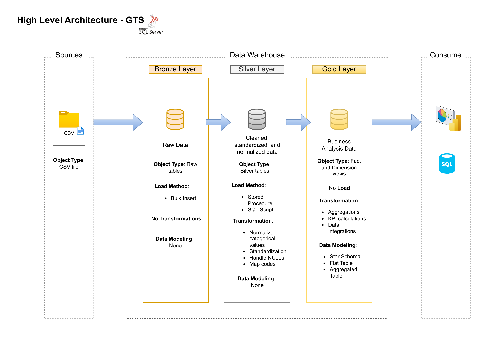
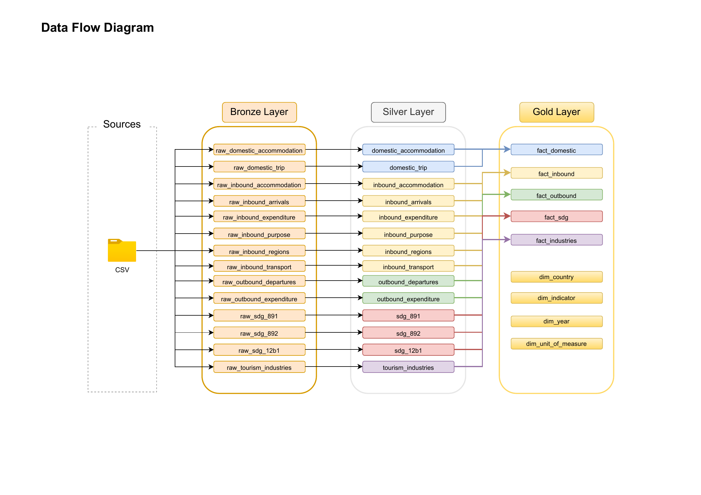
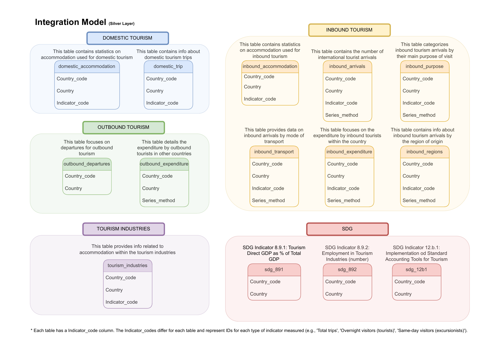
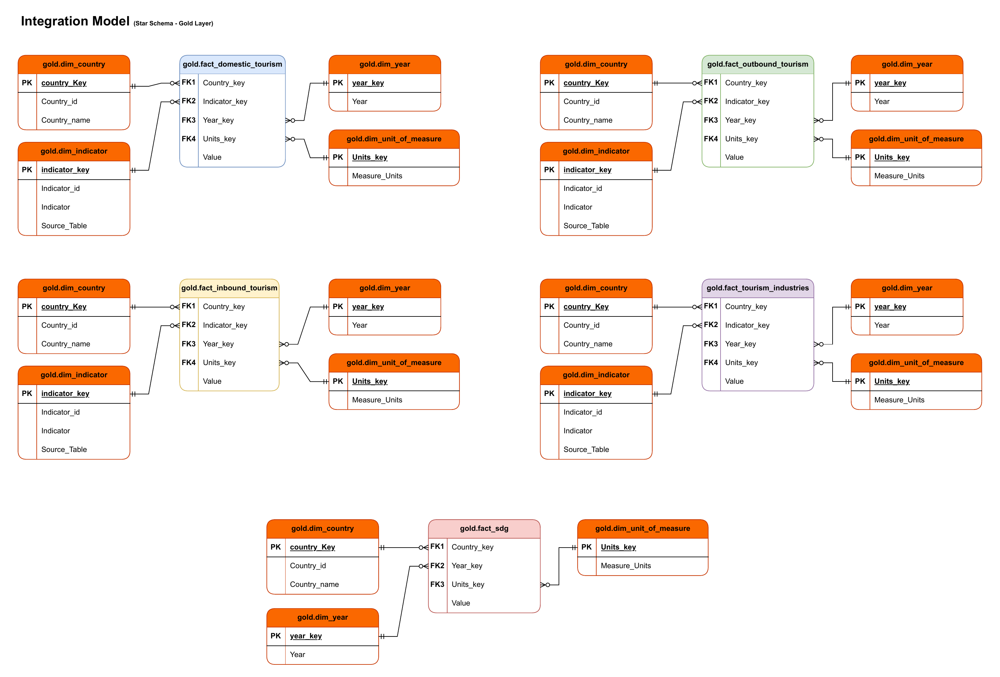

# 🌍 Global Tourism Statistics Data Warehouse

Welcome to the **Global Tourism Statistics Data Warehouse** repository! 🚀  
This project demonstrates the design and implementation of a modern data warehouse using **Medallion Architecture (Bronze → Silver → Gold)**, applied to real-world datasets on global tourism and UN SDG indicators.  

It is built to showcase **Data Engineering, SQL Development, and Data Analytics** skills in a professional, portfolio-ready format.  

---

## 🏗️ Data Architecture

The architecture follows the Medallion approach:  

  

1. **Bronze Layer** → Raw data ingested from CSV (UN Tourism Statistics + UN SDG datasets).  
2. **Silver Layer** → Cleaned, standardized, and normalized data, with null-handling and code mappings.  
3. **Gold Layer** → Business-ready data, organized into fact and dimension views (star schema).  

---

## 🔄 Data Flow

The data ingestion and transformation pipeline is structured as follows:  

  

- **Sources**: UN Tourism Statistics (domestic, inbound, outbound, industries) and SDG indicators (8.9.1, 8.9.2, 12.b.1).  
- **Bronze Layer**: Raw CSV imported into SQL Server with `BULK INSERT`.  
- **Silver Layer**: Cleaning, transformations, and standardization.  
- **Gold Layer**: Star schema with fact tables (domestic, inbound, outbound, industries, SDG) and dimension tables (country, indicator, year, unit of measure).  

---

## 📊 Integration Models

### Silver Layer Integration Model  

  

- Contains cleaned and standardized tourism and SDG datasets.  
- Each dataset retains **Country_code, Country, Indicator_code, and Units**.  
- Provides a unified and analysis-ready structure.  

### Gold Layer Integration Model  

  

- **Star Schema** design with Fact and Dimension views:  
  - **Dimensions**: Country, Indicator, Year, Unit of Measure.  
  - **Facts**: Domestic Tourism, Inbound Tourism, Outbound Tourism, Tourism Industries, SDG indicators.  
- Ensures referential integrity and supports analytical queries.  

---

## 📖 Project Overview

This project involves:  

1. **Data Architecture** → Medallion (Bronze, Silver, Gold).  
2. **ETL Pipelines** → SQL-based transformations from CSV to Gold.  
3. **Data Modeling** → Fact & Dimension views (star schema).  
4. **Data Quality** → Foreign key integrity checks and null handling.  
5. **Analytics & Reporting** → Business-ready datasets for visualization (Tableau/Power BI).  

🎯 Skills demonstrated:  
- SQL Server (T-SQL)  
- Data Engineering (ETL/ELT)  
- Data Modeling (Star Schema)  
- Data Quality & Integrity  
- Analytics Preparation  

---

## 🛠️ Tools & Technologies

- **SQL Server (SSMS)** → Database & ETL implementation.  
- **GitHub** → Version control & portfolio sharing.  
- **Draw.io** → Diagrams for architecture and modeling.  
- **Tableau/Power BI** (optional) → Visualization and reporting.  
- **Excel** → Preliminary data inspection.  

---

## 📂 Repository Structure

```
global-tourism-dwh/
│
├── datasets/                     # Raw CSV datasets (UNWTO, SDG)
│
├── scripts/                      # SQL Scripts (Bronze → Silver → Gold)
│   ├── bronze/                   # BULK INSERT raw tables
│   ├── silver/                   # Cleaning & transformation scripts
│   ├── gold/                     # Fact & Dimension views
│
├── docs/                         # Documentation & diagrams
│   ├── Data_Architecture.png
│   ├── Data_flow.png
│   ├── Integration_Model_Silver.png
│   ├── Integration_Model_Gold.png
│
├── tests/                        # Foreign key & data integrity checks
│
├── README.md                     # Project overview (this file)
└── LICENSE                       # License info
```

---

## 🚀 Next Steps

- [ ] Build Tableau dashboards for global tourism KPIs.  

---

## 📂 Datasets

The datasets used in this project come from **Kaggle**:  
- [Original dataset link](https://www.kaggle.com/datasets/aritra100/global-tourism-statistics)  

I have applied minor modifications using Excel (delimiter changes from `,` to `;`) to make them compatible with SQL Server bulk insert operations.

⚠️ Note: This project is for **educational and portfolio purposes** only.  
All rights remain with the original dataset authors.

---

## 🛡️ License

This project is licensed under the **MIT License**.  

---

## 🌟 About Me

Hi, I’m **Daniele Amoroso** 👋  
HR Generalist transitioning into **Data Analytics and Data Science**, with a focus on SQL, Python, and AI Automation.

Currently transitioning into the data field by building portfolio projects that combine technical skills with analytical thinking.  

📌 Connect with me on LinkedIn → [Daniele Amoroso](https://www.linkedin.com/in/daniele-a-080786b7/)]  
